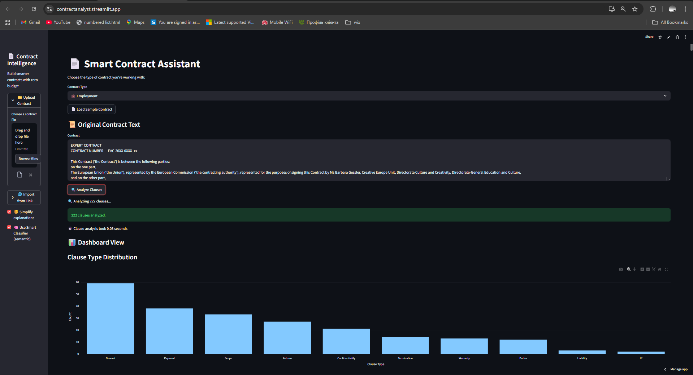
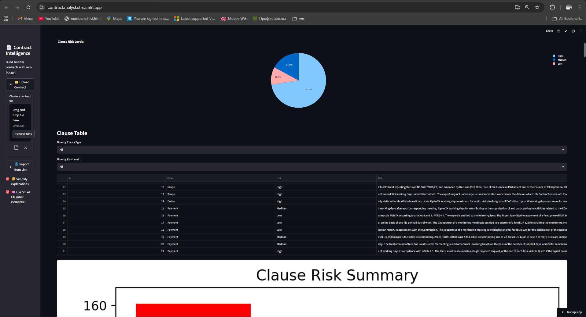
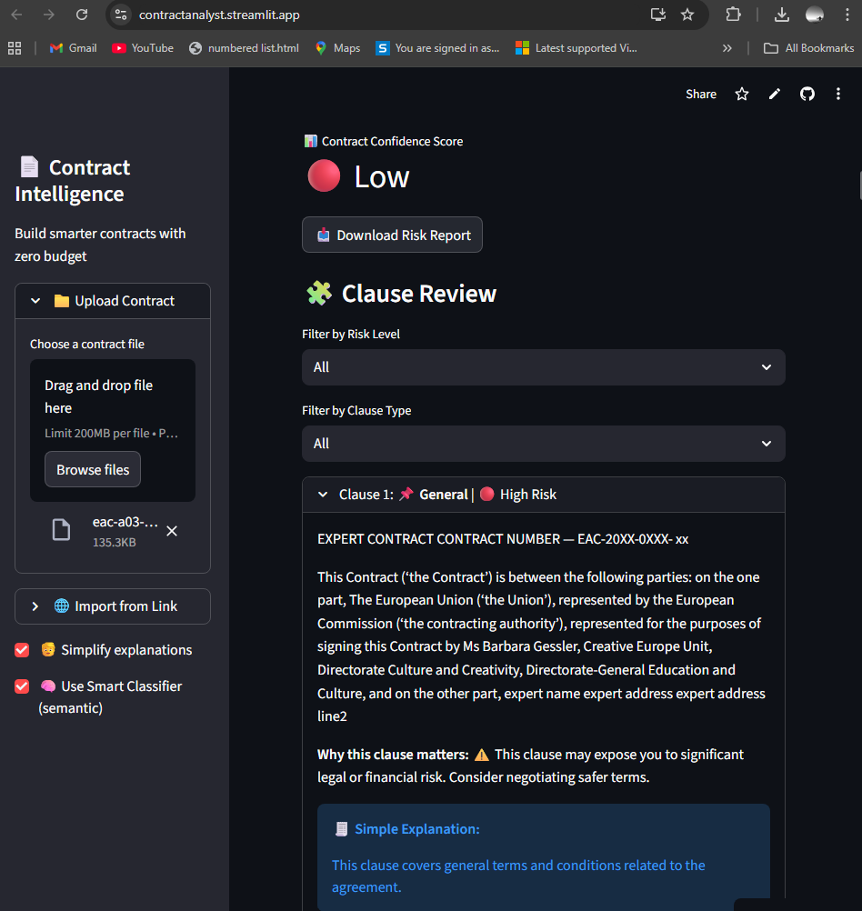

Absolutely, Gordon — here’s your updated and final `README.md` with the live app link included:

---

# 📄 Contract Intelligence Platform

**AI-powered clause analysis, risk detection, and negotiation support for smarter contracts.**  
Built with Streamlit, Transformers, and a feedback-driven learning engine.

👉 **Live App:** [contractanalyst.streamlit.app](https://contractanalyst.streamlit.app)



---

## 🚀 Features

- 🔍 **Clause Detection & Classification**  
  Automatically identifies clause types (e.g., Termination, Payment, Confidentiality) using keyword and semantic models.

- ⚠️ **Risk Scoring & Highlighting**  
  Flags clauses as High, Medium, or Low risk with visual highlights and explanations.

- 🧠 **Persona-Based Negotiation**  
  Simulates negotiation using customizable personas and styles (e.g., Assertive, Friendly, Legalese).

- ✍️ **Rewrite Suggestions**  
  Generates and ranks counter-proposals using summarization, semantic similarity, and risk delta.

- 📊 **Analytics Dashboard**  
  Visualizes clause distribution and risk breakdowns with interactive charts.

- 🌍 **Multilingual Support**  
  Optional clause translation (e.g., to Hungarian) via Google Translate.

- 📤 **Export Tracked Changes**  
  Download negotiation drafts with inline diffs in HTML or DOCX format.

- 🧪 **Smart Classifier (Experimental)**  
  Zero-shot clause type and risk prediction using `facebook/bart-large-mnli`.

- 🧬 **Feedback-Driven Learning**  
  Accept/reject feedback trains a logistic regression model to improve ranking over time.

---

## 🧱 Architecture

```
core/
├── analysis.py           # Clause labeling, risk scoring, explanations
├── clause_explanations.py# Human-readable clause type descriptions
├── config.py             # Risk terms, keyword maps, default weights
├── export.py             # HTML & DOCX tracked changes export
├── models.py             # Summarizer & embedder pipelines
├── negotiation.py        # Persona-based negotiation simulation
├── ranking.py            # Scoring, feedback logging, model training
├── samples.py            # Sample contracts for testing
├── state.py              # Session state persistence
├── utils.py              # Risk highlighting, hashing, formatting
main.py                   # Streamlit app entry point
api.py                    # FastAPI backend for PDF clause analysis
requirements.txt          # Python dependencies
```

> 💡 Note: A `Home.py` file was originally developed as a prototype, but I consolidated all functionality into `main.py` for clarity and maintainability. This decision ensures a single, streamlined entry point for the Streamlit app while keeping the architecture clean and intuitive.

---

## 🛠️ Installation

### 1. Clone the repo

```bash
git clone https://github.com/your-username/contract-intelligence.git
cd contract-intelligence
```

### 2. Create and activate a virtual environment

**PowerShell:**

```powershell
python -m venv .venv
.\.venv\Scripts\Activate.ps1
```

**Command Prompt:**

```cmd
python -m venv .venv
.\.venv\Scripts\activate.bat
```

### 3. Install dependencies

```bash
pip install -r requirements.txt
```

### 4. Run the app

```bash
streamlit run main.py
```

---

## 🖼️ Screenshots

### Clause Review with Risk Highlighting


### Risk Distribution Dashboard


### Clause Table with Semantic Classifier


---

## 🧪 API Endpoint

A lightweight FastAPI backend for clause analysis:

```http
POST /analyze
Content-Type: multipart/form-data
Body: file=<PDF>, contract_type=nda
```

**Returns:**

```json
{
  "clause_type": "Confidentiality",
  "risk_level": "High",
  "explanation": "...",
  "risk_note": "..."
}
```

---

## 🧠 Ranking Weights

Customize how rewrite candidates are scored:

```json
{
  "w_risk": 2.0,
  "w_sim": 1.2,
  "w_len": 0.5
}
```

---

## 📂 Sample Contracts

Use built-in samples for quick testing:

- NDA
- Rental Agreement
- Employment Contract
- Service Agreement
- Sales Contract
- General Terms

---

## 🤝 Contributing

Pull requests welcome! To contribute:

1. Fork the repo  
2. Create a new branch (`git checkout -b feature/your-feature`)  
3. Commit your changes  
4. Push and open a PR

---

## 📜 License

MIT License — free to use, modify, and distribute.
